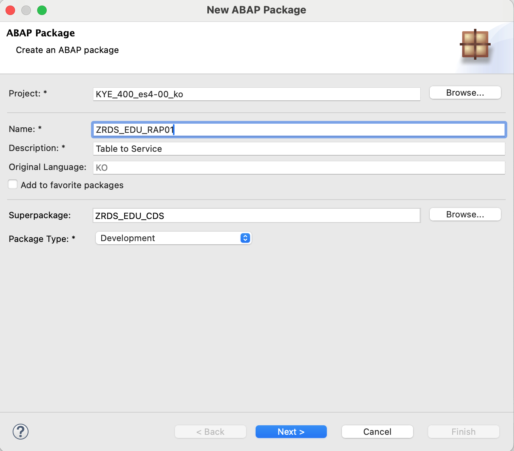

# 실습 - RAP - Table to Service

  

### 1\. 먼저 저장할 테이블을 설계하여 생성한다. 판매오더를 생성하는 요구사항이어서 다음과 같이 테이블 2개를 요구사항에 맞게 생성한다.

  

#### \- 시나리오를 담을 Package를 다음과 같이 생성한다.

  

  

  

#### \- 위에서 만든 패키지에 다음의 두개의 테이블을 생성한다.

ZRAP01T001 : 판매오더헤더

ZRAP01T002 : 판매오더아이템

  

```
@EndUserText.label : '판매오더헤더'
@AbapCatalog.enhancement.category : #NOT_EXTENSIBLE
@AbapCatalog.tableCategory : #TRANSPARENT
@AbapCatalog.deliveryClass : #A
@AbapCatalog.dataMaintenance : #RESTRICTED
define table zrap01t001 {
  key mandt          : abap.clnt not null;
  key keyhd          : sysuuid_x16 not null;
  salesorder         : vdm_sales_order;
  salesordertype     : auart;
  salesgroup         : abap.char(10);
  soldtoparty        : abap.char(10);
  createdby          : abp_creation_user;
  createdat          : abp_creation_tstmpl;
  locallastchangedby : abp_locinst_lastchange_user;
  locallastchangedat : abp_locinst_lastchange_tstmpl;
  lastchangedby      : abp_lastchange_user;
  lastchangedat      : abp_lastchange_tstmpl;

}
```

  

```
@EndUserText.label : '판매오더아이템'
@AbapCatalog.enhancement.category : #NOT_EXTENSIBLE
@AbapCatalog.tableCategory : #TRANSPARENT
@AbapCatalog.deliveryClass : #A
@AbapCatalog.dataMaintenance : #RESTRICTED
define table zrap01t002 {
  key mandt           : abap.clnt not null;
  key keyit           : sysuuid_x16 not null;
  keyhd               : sysuuid_x16 not null;
  salesorder          : vdm_sales_order not null;
  salesorderitem      : sales_order_item;
  material            : matnr;
  @Semantics.quantity.unitOfMeasure : 'zrap01t002.orderquantityunit'
  orderquantity       : abap.quan(15,3);
  orderquantityunit   : abap.unit(3);
  @Semantics.amount.currencyCode : 'zrap01t002.transactioncurrency'
  netamount           : netwr_ap;
  transactioncurrency : waerk;
  createdby           : abp_creation_user;
  createdat           : abp_creation_tstmpl;
  locallastchangedby  : abp_locinst_lastchange_user;
  locallastchangedat  : abp_locinst_lastchange_tstmpl;
  lastchangedby       : abp_lastchange_user;
  lastchangedat       : abp_lastchange_tstmpl;

}
```

  

### 2\. 테이블을 이용하여 비즈니스의미를 넣은 Basic CDS View를 생성한다.

- 필드명
- 필드라벨
- Semantics Annotation 관련 설정
- Association
- VDM 설정

  

판매오더헤더에 대해서 다음의 CDS뷰를 생성한다

- ZRAP\_I\_SALES\_ORDER : 판매오더
- TYPE : BASIC

```
@AbapCatalog.viewEnhancementCategory: [#NONE]
@AccessControl.authorizationCheck: #NOT_REQUIRED
@EndUserText.label: '판매오더'
@Metadata.ignorePropagatedAnnotations: true
@ObjectModel.usageType:{
    serviceQuality: #X,
    sizeCategory: #S,
    dataClass: #MIXED
}
@VDM.viewType: #BASIC
define view entity ZRAP_I_SALES_ORDER
  as select from zrap01t001
  association [0..*] to ZRAP_I_SALES_ORDER_ITEM as _Item           on $projection.KeyHead = _Item.KeyHead
  association [0..1] to I_SalesOrder            as _SalesOrder     on $projection.SalesOrder = _SalesOrder.SalesOrder
  association [0..1] to I_SalesOrderType        as _SalesOrderType on $projection.SalesOrderType = _SalesOrderType.SalesOrderType
  association [0..1] to I_SalesGroup            as _SalesGroup     on $projection.SalesGroup = _SalesGroup.SalesGroup
  association [0..1] to I_Customer              as _SoldToParty    on $projection.SoldToParty = _SoldToParty.Customer
{
      @EndUserText.label: '판매오더키'
      @EndUserText.quickInfo: '판매오더키'
  key keyhd              as KeyHead,

      @EndUserText.label: '판매오더'
      @EndUserText.quickInfo: '판매오더'
      salesorder         as SalesOrder,

      @EndUserText.label: '오더유형'
      @EndUserText.quickInfo: '오더유형'
      salesordertype     as SalesOrderType,

      @EndUserText.label: '판매그룹'
      @EndUserText.quickInfo: '판매그룹'
      salesgroup         as SalesGroup,

      @EndUserText.label: '판매처'
      @EndUserText.quickInfo: '판매처'
      soldtoparty        as SoldToParty,

      @EndUserText.label: '생성자'
      @EndUserText.quickInfo: '생성자'
      @Semantics.user.createdBy: true
      createdby          as CreatedBy,

      @EndUserText.label: '생성일시'
      @EndUserText.quickInfo: '생성일시'
      @Semantics.systemDate.createdAt: true
      createdat          as CreatedAt,

      @EndUserText.label: '변경자'
      @EndUserText.quickInfo: '변경자'
      @Semantics.user.localInstanceLastChangedBy: true
      locallastchangedby as LocalLastChangedBy,

      @EndUserText.label: '변경일시'
      @EndUserText.quickInfo: '변경일시'
      @Semantics.systemDateTime.localInstanceLastChangedAt: true
      locallastchangedat as LocalLastChangedAt,

      @EndUserText.label: '변경자'
      @EndUserText.quickInfo: '변경자'
      @Semantics.user.lastChangedBy: true
      lastchangedby      as LastChangedBy,

      @EndUserText.label: '변경일시'
      @EndUserText.quickInfo: '변경일시'
      @Semantics.systemDate.lastChangedAt: true
      lastchangedat      as LastChangedAt,

      // Associaiton
      _Item,

      _SalesOrder,

      _SalesOrderType,

      _SalesGroup,

      _SoldToParty
}
```

  

판매오더아이템에 대해서 다음의 CDS뷰를 생성한다

- ZRAP\_I\_SALES\_ORDER\_ITEM : 판매오더아이템
- TYPE : BASIC

```
@AbapCatalog.viewEnhancementCategory: [#NONE]
@AccessControl.authorizationCheck: #NOT_REQUIRED
@EndUserText.label: '판매오더아이템'
@Metadata.ignorePropagatedAnnotations: false
@ObjectModel.usageType:{
  serviceQuality: #X,
  sizeCategory: #S,
  dataClass: #MIXED
}
define view entity ZRAP_I_SALES_ORDER_ITEM
  as select from zrap01t002
  association [1..1] to ZRAP_I_SALES_ORDER as _Head           on  $projection.KeyHead = _Head.KeyHead
  association [0..1] to I_SalesOrderItem   as _SalesOrderItem on  $projection.SalesOrder     = _SalesOrderItem.SalesOrder
                                                              and $projection.SalesOrderItem = _SalesOrderItem.SalesOrderItem
  association [0..1] to I_Product          as _Material       on  $projection.Material = _Material.Product
  association [0..1] to I_UnitOfMeasure    as _Unit           on  $projection.OrderQuantityUnit = _Unit.UnitOfMeasure
  association [0..1] to I_Currency         as _Currency       on  $projection.TransactionCurrency = _Currency.Currency
{
      @EndUserText.label: '판매오더아이템키'
      @EndUserText.quickInfo: '판매오더아이키'
  key keyit               as KeyItem,

      @EndUserText.label: '판매오더키'
      @EndUserText.quickInfo: '판매오더키'
      keyhd               as KeyHead,

      @EndUserText.label: '판매오더'
      @EndUserText.quickInfo: '판매오더'
      salesorder          as SalesOrder,

      @EndUserText.label: '순번'
      @EndUserText.quickInfo: '순번'
      salesorderitem      as SalesOrderItem,

      @EndUserText.label: '자재'
      @EndUserText.quickInfo: '자재'
      material            as Material,

      @EndUserText.label: '수량'
      @EndUserText.quickInfo: '수량'
      orderquantity       as OrderQuantity,

      @EndUserText.label: '단위'
      @EndUserText.quickInfo: '단위'
      orderquantityunit   as OrderQuantityUnit,

      @EndUserText.label: '순가격'
      @EndUserText.quickInfo: '순가격'
      netamount           as NetAmount,

      @EndUserText.label: '통화'
      @EndUserText.quickInfo: '통화'
      transactioncurrency as TransactionCurrency,

      @EndUserText.label: '생성자'
      @EndUserText.quickInfo: '생성자'
      @Semantics.user.createdBy: true
      createdby           as CreatedBy,

      @EndUserText.label: '생성일시'
      @EndUserText.quickInfo: '생성일시'
      @Semantics.systemDate.createdAt: true
      createdat           as CreatedAt,

      @EndUserText.label: '변경자'
      @EndUserText.quickInfo: '변경자'
      @Semantics.user.localInstanceLastChangedBy: true
      locallastchangedby  as LocalLastChangedBy,

      @EndUserText.label: '변경일시'
      @EndUserText.quickInfo: '변경일시'
      @Semantics.systemDateTime.localInstanceLastChangedAt: true
      locallastchangedat  as LocalLastChangedAt,

      @EndUserText.label: '변경자'
      @EndUserText.quickInfo: '변경자'
      @Semantics.user.lastChangedBy: true
      lastchangedby       as LastChangedBy,

      @EndUserText.label: '변경일시'
      @EndUserText.quickInfo: '변경일시'
      @Semantics.systemDate.lastChangedAt: true
      lastchangedat       as LastChangedAt,

      // Associations
      _Head,
      
      _SalesOrderItem,

      _Material,

      _Unit,

      _Currency
}
```

  

  

### 3\. Transaction을 처리하기 위해서 Business Object 관련 항목을 생성한다.

- Business Object = Root CDS View + Behavior Definition + Behavior Implementation
- Composition 관계 (has a)

  

#### Root View를 생성한다.

- ZRAP\_R\_SALES\_ORDER : 판매오더

  

```
@AccessControl.authorizationCheck: #NOT_REQUIRED
@EndUserText.label: '판매오더'
define root view entity ZRAP_R_SALES_ORDER
  as select from ZRAP_I_SALES_ORDER
  composition [0..*] of ZRAP_R_SALES_ORDER_ITEM as _ItemBO
{
  key KeyHead,

      SalesOrder,

      SalesOrderType,

      SalesGroup,

      SoldToParty,

      CreatedBy,

      CreatedAt,

      LocalLastChangedBy,

      LocalLastChangedAt,

      LastChangedBy,

      LastChangedAt,

      /* Associations */
      _Item,

      _SalesGroup,

      _SalesOrder,

      _SalesOrderType,

      _SoldToParty,

      /* Composition */
      _ItemBO
}
```

  

#### Child View를 생성한다.

- ZRAP\_R\_SALES\_ORDER\_ITEM : 판매오더아이템

  

```
@AccessControl.authorizationCheck: #NOT_REQUIRED
@EndUserText.label: '판매오더아이템'
define view entity ZRAP_R_SALES_ORDER_ITEM
  as select from ZRAP_I_SALES_ORDER_ITEM
  association to parent ZRAP_R_SALES_ORDER as _HeadBO on $projection.KeyHead = _HeadBO.KeyHead
{
  key KeyItem,

      KeyHead,

      SalesOrder,

      SalesOrderItem,

      Material,

      OrderQuantity,

      OrderQuantityUnit,

      NetAmount,

      TransactionCurrency,

      CreatedBy,

      CreatedAt,

      LocalLastChangedBy,

      LocalLastChangedAt,

      LastChangedBy,

      LastChangedAt,

      /* Associations */
      _Currency,

      _Head,

      _Material,

      _SalesOrderItem,

      _Unit,

      /* Composition */
      _HeadBO
}
```

  

  

#### Transaction에 대한 정의부분을 위해서 Behavior Definition을 생성한다.

- Root View를 통해서 하나만 생성

  

  

  

```
managed implementation in class zbp_rap_r_sales_order unique;
strict ( 2 );

define behavior for ZRAP_R_SALES_ORDER alias SalesOrder
persistent table zrap01t001
lock master
authorization master ( instance )
etag master LastChangedAt
{
  create;
  update;
  delete;

  field ( readonly, numbering : managed ) KeyHead;

  association _ItemBO { create; }

  determination determineInter on modify {
    create;
  }

  determination determineSave on save {
    create;
  }

  validation validateSave on save {
    create;
    update;
  }

  action updateSalesGroup parameter zrds_a_param01;

  mapping for zrap01t001
  {
    KeyHead = KEYHD;
    SalesOrder = SALESORDER;
    SalesOrderType = SALESORDERTYPE;
    SalesGroup = SALESGROUP;
    SoldToParty = SOLDTOPARTY;
    CreatedBy = CREATEDBY;
    CreatedAt = CREATEDAT;
    LocalLastChangedBy = LOCALLASTCHANGEDBY;
    LocalLastChangedAt = LOCALLASTCHANGEDAT;
    LastChangedBY = LASTCHANGEDBY;
    LastChangedAt = LASTCHANGEDAT;
  }
}

define behavior for ZRAP_R_SALES_ORDER_ITEM alias SalesOrderItem
persistent table zrap01t002
lock dependent by _HeadBO
authorization dependent by _HeadBO
etag master LastChangedAt
{
  update;
  delete;

  field ( readonly, numbering : managed ) KeyItem;
  field ( readonly ) KeyHead;

  association _HeadBO;

  mapping for zrap01t002
  {
    KeyItem = KEYIT;
    KeyHead = KEYHD;
    SalesOrder = SALESORDER;
    SalesOrderItem = SALESORDERITEM;
    Material = MATERIAL;
    OrderQuantity = ORDERQUANTITY;
    OrderQuantityUnit = ORDERQUANTITYUNIT;
    NetAmount = NETAMOUNT;
    TransactionCurrency = TRANSACTIONCURRENCY;
    CreatedBy = CREATEDBY;
    CreatedAt = CREATEDAT;
    LocalLastChangedBy = LOCALLASTCHANGEDBY;
    LocalLastChangedAt = LOCALLASTCHANGEDAT;
    LastChangedBy = LASTCHANGEDBY;
    LastChangedAt = LASTCHANGEDAT;
  }
}
```

  

#### Transaction 처리를 위한 구현클래스를 생성하고 로직을 작성한다.

  

  

```
CLASS lhc_salesorder DEFINITION INHERITING FROM cl_abap_behavior_handler.
  PRIVATE SECTION.

    METHODS get_instance_authorizations FOR INSTANCE AUTHORIZATION
      IMPORTING keys REQUEST requested_authorizations FOR salesorder RESULT result.
    METHODS determineinter FOR DETERMINE ON MODIFY
      IMPORTING keys FOR salesorder~determineinter.

    METHODS determinesave FOR DETERMINE ON SAVE
      IMPORTING keys FOR salesorder~determinesave.

    METHODS validatesave FOR VALIDATE ON SAVE
      IMPORTING keys FOR salesorder~validatesave.
    METHODS updatesalesgroup FOR MODIFY
      IMPORTING keys FOR ACTION salesorder~updatesalesgroup.

ENDCLASS.

CLASS lhc_salesorder IMPLEMENTATION.

  METHOD get_instance_authorizations.
  ENDMETHOD.

  METHOD determineinter.

    READ ENTITIES OF zrap_r_sales_order IN LOCAL MODE
    ENTITY salesorder
    ALL FIELDS WITH VALUE #( ( %tky = keys[ 1 ]-%tky ) )
    RESULT DATA(lt_head)
    BY \_itembo
    ALL FIELDS WITH VALUE #( FOR head IN keys (
      %tky = head-%tky
    ) )
    RESULT DATA(lt_item).

    MODIFY ENTITIES OF zrap_r_sales_order IN LOCAL MODE
    ENTITY salesorder
    UPDATE FIELDS
    (
      salesgroup
    )
    WITH VALUE #(
        (
          %tky            = keys[ 1 ]-%tky
          salesgroup      = |2000|
        )
      )
    FAILED DATA(ls_failed)
    REPORTED DATA(ls_reported).

  ENDMETHOD.

  METHOD determinesave.

    READ ENTITIES OF zrap_r_sales_order IN LOCAL MODE
    ENTITY salesorder
    ALL FIELDS WITH VALUE #( ( %tky = keys[ 1 ]-%tky ) )
    RESULT DATA(lt_head)
    BY \_itembo
    ALL FIELDS WITH VALUE #( FOR head IN keys (
      %tky = head-%tky
    ) )
    RESULT DATA(lt_item).

    MODIFY ENTITIES OF zrap_r_sales_order IN LOCAL MODE
    ENTITY salesorder
    UPDATE FIELDS
    (
      salesordertype
    )
    WITH VALUE #(
        (
          %tky            = keys[ 1 ]-%tky
          salesordertype  = |OT01|
        )
      )
    FAILED DATA(ls_failed)
    REPORTED DATA(ls_reported).

  ENDMETHOD.

  METHOD validatesave.

    READ ENTITIES OF zrap_r_sales_order IN LOCAL MODE
    ENTITY salesorder
    ALL FIELDS WITH VALUE #( ( %tky = keys[ 1 ]-%tky ) )
    RESULT DATA(lt_head)
    BY \_itembo
    ALL FIELDS WITH VALUE #( FOR head IN keys (
      %tky = head-%tky
    ) )
    RESULT DATA(lt_item).

    LOOP AT lt_head[] INTO DATA(ls_head).
      IF ls_head-salesgroup IS INITIAL.
        APPEND INITIAL LINE TO failed-salesorder ASSIGNING FIELD-SYMBOL(<fs_salesorder>).
        <fs_salesorder>-%tky        = ls_head-%tky.
        <fs_salesorder>-%create     = if_abap_behv=>mk-on.
        <fs_salesorder>-%fail-cause = if_abap_behv=>cause-unspecific.

        APPEND INITIAL LINE TO reported-salesorder ASSIGNING FIELD-SYMBOL(<fs_salesorder_rep>).
        <fs_salesorder_rep>-%tky    = ls_head-%tky.
        <fs_salesorder_rep>-%create = if_abap_behv=>mk-on.
        <fs_salesorder_rep>-%msg    = NEW zrds_message( textid = zrds_message=>rap_message severity = if_abap_behv_message=>severity-error errormsg =  'Error' ).

        RETURN.
      ENDIF.
    ENDLOOP.

  ENDMETHOD.

  METHOD updatesalesgroup.

    READ ENTITIES OF zrap_r_sales_order IN LOCAL MODE
    ENTITY salesorder
    ALL FIELDS WITH VALUE #( ( %tky = keys[ 1 ]-%tky ) )
    RESULT DATA(lt_head).

    IF keys[ 1 ]-%param-salesgroup IS INITIAL.
      APPEND INITIAL LINE TO failed-salesorder ASSIGNING FIELD-SYMBOL(<fs_salesorder>).
      <fs_salesorder>-%tky        = keys[ 1 ]-%tky.
      <fs_salesorder>-%create     = if_abap_behv=>mk-on.
      <fs_salesorder>-%fail-cause = if_abap_behv=>cause-unspecific.

      APPEND INITIAL LINE TO reported-salesorder ASSIGNING FIELD-SYMBOL(<fs_salesorder_rep>).
      <fs_salesorder_rep>-%tky    = keys[ 1 ]-%tky.
      <fs_salesorder_rep>-%create = if_abap_behv=>mk-on.
      <fs_salesorder_rep>-%msg    = NEW zrds_message( textid = zrds_message=>rap_message severity = if_abap_behv_message=>severity-error errormsg =  '판매그룹 미입력' ).

      RETURN.
    ENDIF.

    MODIFY ENTITIES OF zrap_r_sales_order IN LOCAL MODE
    ENTITY salesorder
    UPDATE FIELDS
    (
      salesgroup
    )
    WITH VALUE #(
        (
          %tky        = keys[ 1 ]-%tky
          salesgroup  = keys[ 1 ]-%param-salesgroup
        )
      )
    FAILED DATA(ls_failed)
    REPORTED DATA(ls_reported).

    failed = ls_failed.
    reported = ls_reported.

  ENDMETHOD.

ENDCLASS.
```

  

Message Class

```
CLASS zrds_message DEFINITION
  PUBLIC
  INHERITING FROM cx_static_check
  FINAL
  CREATE PUBLIC .

  PUBLIC SECTION.

    INTERFACES if_abap_behv_message .
    INTERFACES if_t100_message .
    INTERFACES if_t100_dyn_msg .

    DATA : errormessage TYPE string READ-ONLY.

    METHODS constructor
      IMPORTING
        !severity TYPE if_abap_behv_message=>t_severity DEFAULT if_abap_behv_message=>severity-error
        !textid   LIKE if_t100_message=>t100key OPTIONAL
        !errormsg TYPE string OPTIONAL
        !previous LIKE previous OPTIONAL .

    CONSTANTS :
      BEGIN OF rap_message,
        msgid TYPE symsgid      VALUE 'ZRDS01',
        msgno TYPE symsgno      VALUE '900',
        attr1 TYPE scx_attrname VALUE 'ERRORMESSAGE',
        attr2 TYPE scx_attrname VALUE '',
        attr3 TYPE scx_attrname VALUE '',
        attr4 TYPE scx_attrname VALUE '',
      END OF rap_message.

  PROTECTED SECTION.
  PRIVATE SECTION.
ENDCLASS.


CLASS zrds_message IMPLEMENTATION.

  METHOD constructor ##ADT_SUPPRESS_GENERATION.
    CALL METHOD super->constructor
      EXPORTING
        previous = previous.

    CLEAR me->textid.

    IF textid IS INITIAL.
      if_t100_message~t100key = if_t100_message=>default_textid.
    ELSE.
      if_t100_message~t100key = textid.
    ENDIF.

    me->if_abap_behv_message~m_severity = severity.
    me->errormessage = errormsg.

  ENDMETHOD.

ENDCLASS.
```

###   

### 4\. 해당 CDS는 서비스로 제공을 해야하기 때문에, 서비스로 제공할 필드 또는 Transaction (Create/Update/Delete/Action/Function)을 선택하는 작업을 Projection View와 Projection Behavior를 통해서 진행한다.

  

**Projection View를 생성한다**

- ZRAP\_P\_SALES\_ORDER : 판매오더

  

  

```
@EndUserText.label: '판매오더'
@AccessControl.authorizationCheck: #NOT_REQUIRED
define root view entity ZRAP_P_SALES_ORDER
  provider contract transactional_query
  as projection on ZRAP_R_SALES_ORDER
{
  key KeyHead,
 
      SalesOrder,

      SalesOrderType,

      SalesGroup,

      SoldToParty,

      /* Associations */
      _Item,

      _ItemBO : redirected to composition child ZRAP_P_SALES_ORDER_ITEM,

      _SalesGroup,

      _SalesOrder,

      _SalesOrderType,

      _SoldToParty
}
```

  

**Projection View를 생성한다**

- ZRAP\_P\_SALES\_ORDER\_ITEM : 판매오더아이템

```
@EndUserText.label: '판매오더아이템'
@AccessControl.authorizationCheck: #NOT_REQUIRED
define view entity ZRAP_P_SALES_ORDER_ITEM
  as projection on ZRAP_R_SALES_ORDER_ITEM
{
  key KeyItem,

      KeyHead,

      SalesOrder,

      SalesOrderItem,

      Material,

      OrderQuantity,

      OrderQuantityUnit,

      NetAmount,

      TransactionCurrency,

      /* Associations */
      _Currency,

      _Head,

      _HeadBO : redirected to parent ZRAP_P_SALES_ORDER,

      _Material,

      _SalesOrderItem,

      _Unit
}
```

  

#### 다음으로 서비스에 필요한 Behavior Operation을 정의하기 위해서 Projection Behavior Definition을 생성한다.

  

  

이번에 만들 서비스는 delete 기능을 제공하지 않아야 하면 다음과 같이 Delete operation은 제외하고 작성하면 된다.

```
projection;
strict ( 2 );

define behavior for ZRAP_P_SALES_ORDER alias SalesOrder
{
  use create;
  use update;

  use association _ItemBO { create; }
}

define behavior for ZRAP_P_SALES_ORDER_ITEM alias SalesOrderItem
{
  use update;

  use association _HeadBO;
}
```

  

  

### 5\. 앞의 어플리케이션 서비스로 제공할 엔터티에 대한 작업을 모두 완료하면, 서비스에 필요한 엔터티 목록을 정의하는 Service Definition을 생성한다.

  

  

  

  

  

현재는 하나의 엔터티만 앱에서 사용하는 걸로 설정했지만, 필요에 따라서 여러개의 엔터티를 할당하여 서비스를 정의해도 된다.

```
@EndUserText.label: '판매오더 App용 서비스정의'
define service ZRAP_P_SALES_ORDER_UI {
  expose ZRAP_P_SALES_ORDER;
}
```

  

  

### 6\. 앞의 서비스정의 파일은 OData V4 프로토콜의 UI로 만들 예정이므로 해당 프로토콜 및 유형으로 Service Binding을 생성한다.

  

  

  

  

Publish 하기 위해서 활성화 한다.

  

  

Publish 버튼을 눌러준다.

- On-Premise 환경에서는 /IWFND/V4\_ADMIN로 Publish를 한다.

  

  

* * *

ABAP 환경에서 위의 BO를 실행하는 로직을 다음과 같이 작성해 본다.

  

Interaction Phase / Save Phase 구분

```
*&---------------------------------------------------------------------*
*& Report ZRDS_EDU_RAP01
*&---------------------------------------------------------------------*
*&
*&---------------------------------------------------------------------*
REPORT zrds_edu_rap01.

SELECTION-SCREEN BEGIN OF BLOCK b1 WITH FRAME.
  PARAMETERS : p_prefix TYPE c LENGTH 4 OBLIGATORY.
  PARAMETERS : p_sgrp   TYPE zrap_r_sales_order-salesgroup.
SELECTION-SCREEN END OF BLOCK b1.

START-OF-SELECTION.

**********************************************************************
* Interaction Phase
**********************************************************************
  DATA : lv_cid        TYPE sysuuid_x16,
         lv_salesorder TYPE zrap_r_sales_order-salesorder.

  lv_cid        = cl_system_uuid=>create_uuid_x16_static( ).
  lv_salesorder = |{ p_prefix }{ sy-uzeit }|.

  MODIFY ENTITIES OF zrap_r_sales_order
  ENTITY salesorder
  CREATE
    FIELDS (
      salesorder
      soldtoparty )
    WITH VALUE #(
      ( %cid            = lv_cid
        salesorder      = lv_salesorder
        salesgroup      = p_sgrp
        soldtoparty     = |1000000000|
      )
    )
  CREATE BY \_itembo AUTO FILL CID
    FIELDS (
      salesorder
      salesorderitem
      material
      orderquantity
      orderquantityunit
      netamount
      transactioncurrency )
   WITH VALUE #(
    (
      %cid_ref = lv_cid
      %target  = VALUE #(
        (
          salesorder          = lv_salesorder
          salesorderitem      = |000001|
          material            = |MAT0001|
          orderquantity       = '3.000'
          orderquantityunit   = 'EA'
          netamount           = '1000.00'
          transactioncurrency = 'KRW'
        )
      )
     )
   )
   MAPPED DATA(ls_mapped)
   FAILED DATA(ls_failed)
   REPORTED DATA(ls_reported).

  READ ENTITIES OF zrap_r_sales_order
  ENTITY salesorder
  ALL FIELDS WITH VALUE #( ( %tky = ls_mapped-salesorder[ 1 ]-%tky ) )
  RESULT DATA(lt_head)
  BY \_itembo
  ALL FIELDS WITH VALUE #( FOR head IN ls_mapped-salesorder (
    %tky = head-%tky
  ) )
  RESULT DATA(lt_item).

  MODIFY ENTITIES OF zrap_r_sales_order
  ENTITY salesorder
  UPDATE
    FIELDS (
      salesgroup
    )
    WITH VALUE #(
      (
        %tky            = ls_mapped-salesorder[ 1 ]-%tky
        salesgroup      = p_sgrp
      )
    )
  FAILED ls_failed
  REPORTED ls_reported.

  READ ENTITIES OF zrap_r_sales_order
  ENTITY salesorder
  ALL FIELDS WITH VALUE #( ( %tky = ls_mapped-salesorder[ 1 ]-%tky ) )
  RESULT lt_head.
*
***********************************************************************
** Save Phase
***********************************************************************
  COMMIT ENTITIES RESPONSE OF zrap_r_sales_order
  FAILED DATA(ls_failed_commit) REPORTED DATA(ls_reported_commit).

  IF ls_failed_commit-salesorder IS NOT INITIAL.
    MESSAGE 'Error Occured' TYPE 'S' DISPLAY LIKE 'E'.
  ELSE.
    MESSAGE 'Successfully Saved' TYPE 'S'.
  ENDIF.

  BREAK-POINT.
```

  

Action 처리

```
*&---------------------------------------------------------------------*
*& Report ZRDS_EDU_RAP02
*&---------------------------------------------------------------------*
*&
*&---------------------------------------------------------------------*
REPORT zrds_edu_rap02.

SELECTION-SCREEN BEGIN OF BLOCK b1 WITH FRAME.
  PARAMETERS : p_so TYPE zrap_i_sales_order-salesorder OBLIGATORY.
  PARAMETERS : p_sg TYPE zrap_i_sales_order-salesgroup.
SELECTION-SCREEN END OF BLOCK b1.

START-OF-SELECTION.

  SELECT SINGLE
  FROM zrap_i_sales_order
  FIELDS keyhead
  WHERE salesorder = @p_so
  INTO @DATA(lv_keyhead).

  IF sy-subrc <> 0.
    MESSAGE 'Not registered S/O' TYPE 'S' DISPLAY LIKE 'E'.
    RETURN.
  ENDIF.

  MODIFY ENTITIES OF zrap_r_sales_order
  ENTITY salesorder
    EXECUTE updatesalesgroup
      FROM VALUE #( ( %tky-keyhead = lv_keyhead %param = VALUE #( salesgroup = p_sg ) ) )
  FAILED DATA(ls_failed)
  REPORTED DATA(ls_reported).

  IF ls_failed-salesorder IS NOT INITIAL.
    ROLLBACK ENTITIES.

    MESSAGE 'Failed' TYPE 'S' DISPLAY LIKE 'E'.
  ELSE.
    COMMIT ENTITIES RESPONSE OF zrap_r_sales_order FAILED DATA(ls_failed_commit) REPORTED DATA(ls_reported_commit).

    IF ls_failed_commit-salesorder IS INITIAL.
      MESSAGE 'Success' TYPE 'S'.
    ELSE.
      MESSAGE 'Failed - Commit' TYPE 'S' DISPLAY LIKE 'E'.
    ENDIF.
  ENDIF.
```